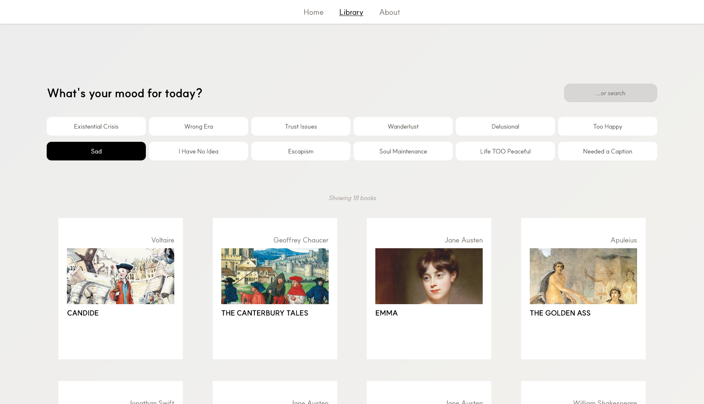
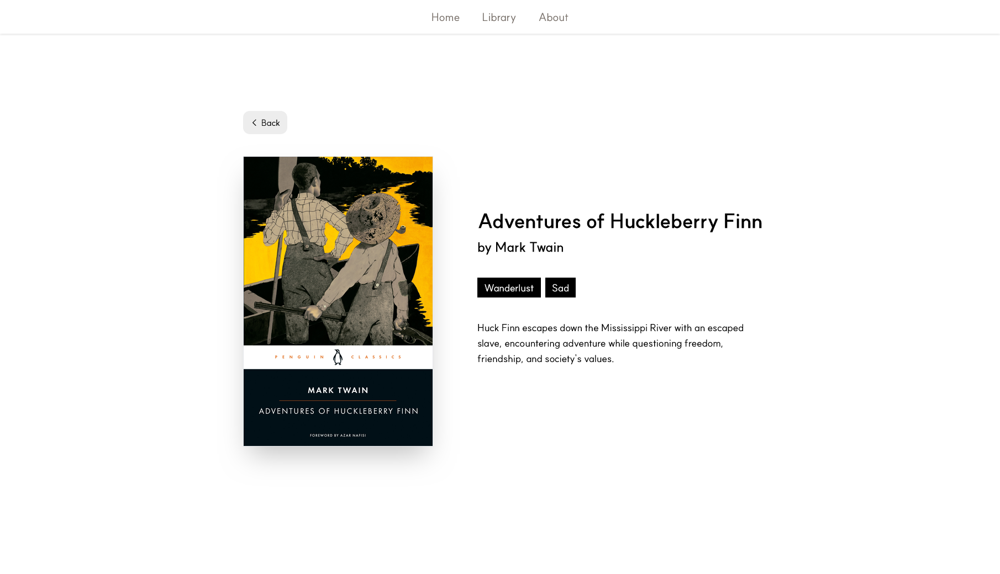
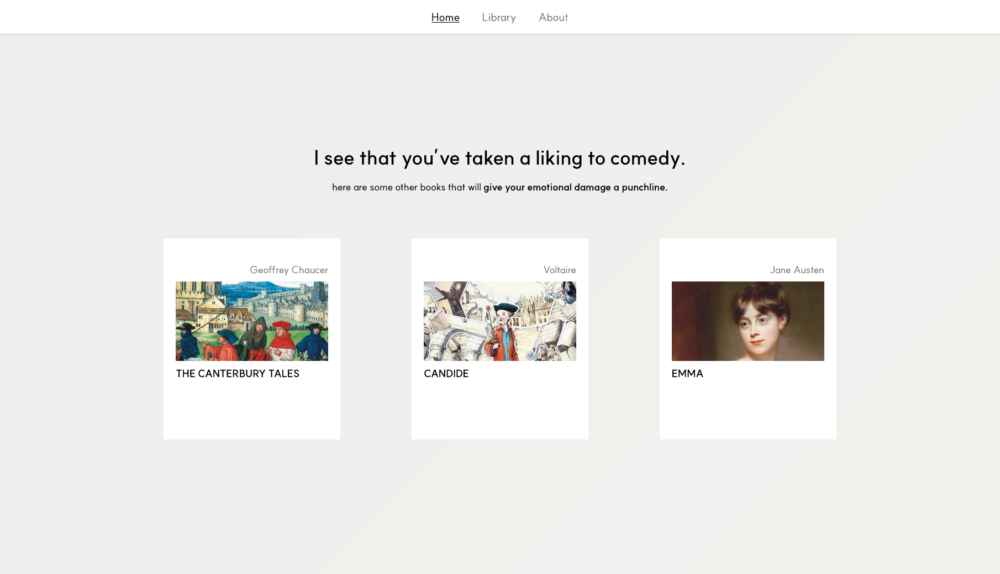
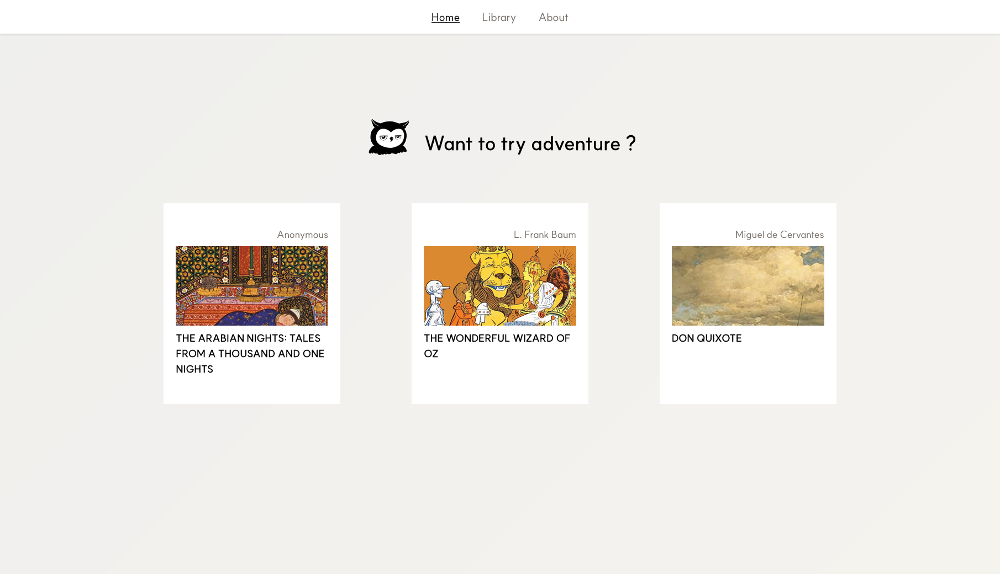

# INK'S LIBRARY

A curated library for discovering books by mood

↗ [Live Demo](https://ink.rchive.me/)

 

## 01 / about

Ink’s Library is a discovery space for readers
who don't always know what they want to read next.

Browse Penguin Classics by mood, explore individual books,
and let Ink — a slightly judgmental owl — make a recommendation.

 

## 02 / features

**Browse and search the library**

**View book details**

**Get personalized recommendations**

  
  

 

## 03 / how it works
> **What's your mood for today?**

Instead of searching by genre, Ink asks how you're feeling.

Each mood is paired with a genre to create a slightly unexpected
way of discovering books. Feeling **Sad**? Ink points you towards **Comedy**.
**"I have no idea."** Try **Self Help**.

Choose a mood, explore the books Ink recommends, and let your
browsing habits shape what comes next.

Here are the mood and genre mappings:

| Mood | Genre |
| --- | --- |
| Existential Crisis | Philosophy |
| Wrong Era | History |
| Trust Issues | Thriller & Mystery |
| Wanderlust | Adventure |
| Hopelessly Romantic | Romance |
| Too Happy | Drama & Tragedy |
| Sad | Comedy |
| I Have No Idea | Self Help |
| Escapism | Fantasy |
| Soul Maintenance | Religion & Spirituality |
| Life TOO Peaceful | Horror |
| Needed a Caption | Poetry |

 

## 04 / stack

`JavaScript` · `React` · `Vite` · `Tailwind CSS`

 

## 05 / credits
- Book editions & cover images — Penguin Classics
- Typeface — [SUIT](https://github.com/sun-typeface/SUIT) by SUNN

Ink's Library is an independent personal project
and is not affiliated with Penguin Classics.

